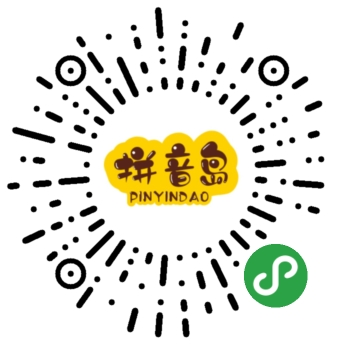

# 小语文/拼音岛 项目文档

Github：https://github.com/lemonoink/xiaoyuwen/

文档地址：https://lemonoink.github.io/xiaoyuwen/

## 项目简介

**小语文App**小语文，主要针对于小学语文拼音、成语、诗词的学习，实现了点读等功能，学练结合，练习采用随机出题，答题生成成绩单的形式；

**拼音岛小程序**主要是针对于app的拼音部分实现了详细分类，包括单韵母、复韵母、鼻韵母等，同样具有点读功能，配套的相应拼音练习听音选字。

## 在线访问

- 小语文app(网页版)：https://xyw.haotian.pub/
- 拼音岛小程序：
  
