# 《小语文》 —— HTML5与移动互联网开发

Github：https://github.com/lemonoink/xiaoyuwen

## 项目简介

**小语文App**是一款针对于小学生的语文学习类APP，该APP主要有拼音，成语，诗词类的学习，且不同年级的学习内容不同。还可以进行对应的题目练习。现阶段学习内容以人教版教材内容为主。

## App截图

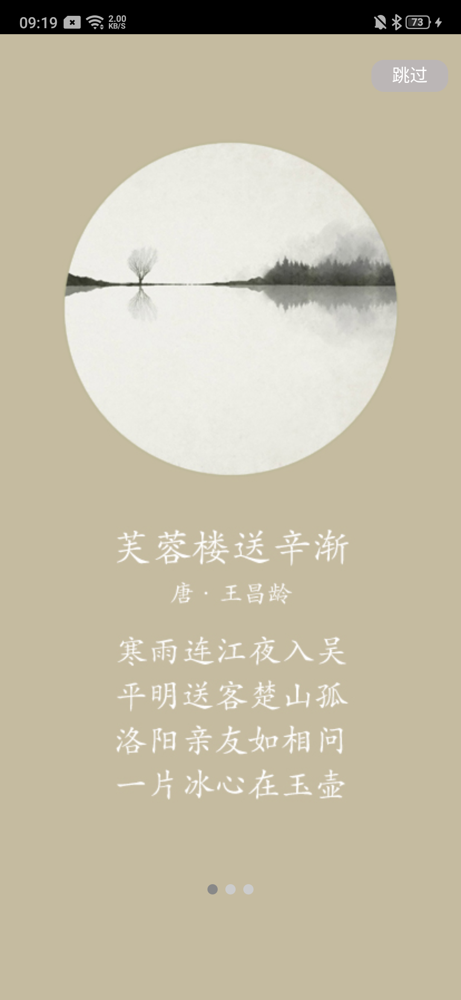

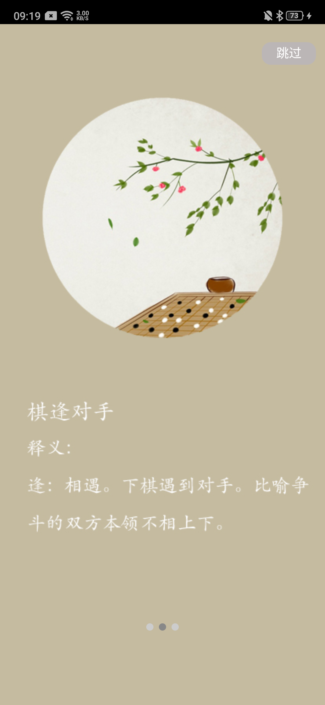

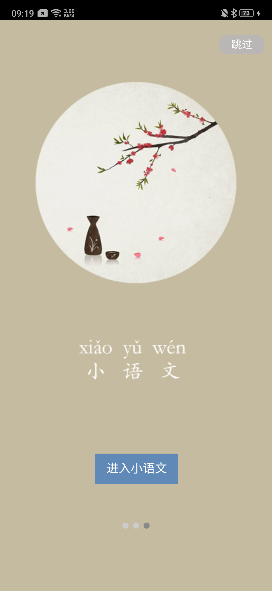

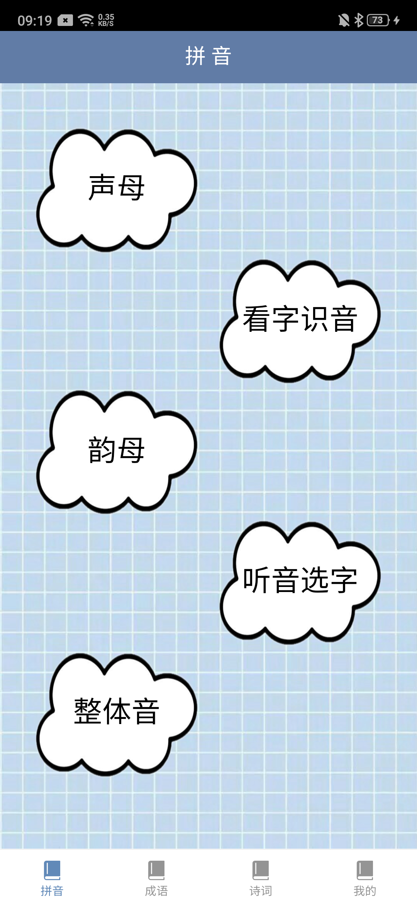

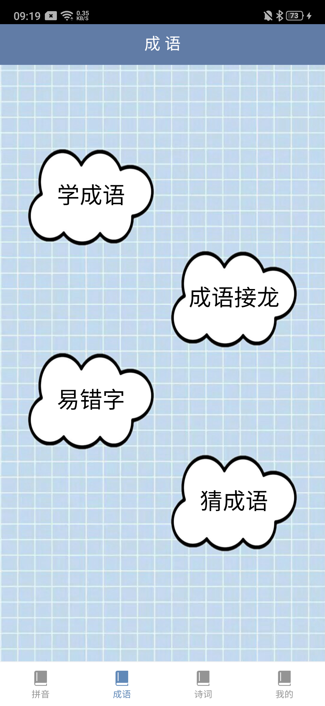

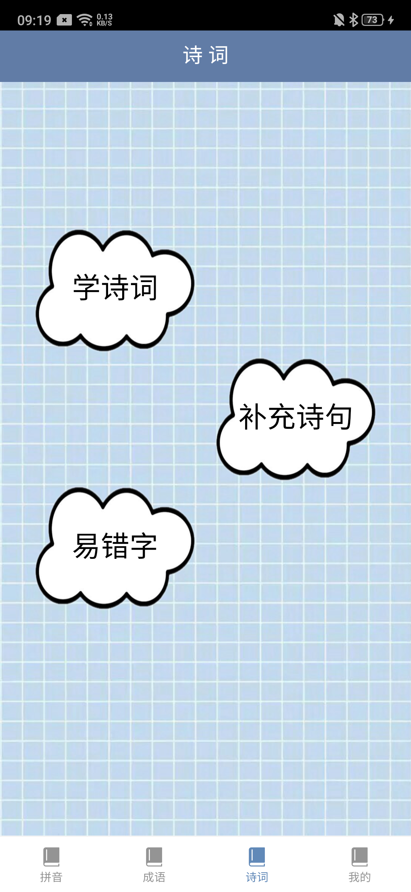

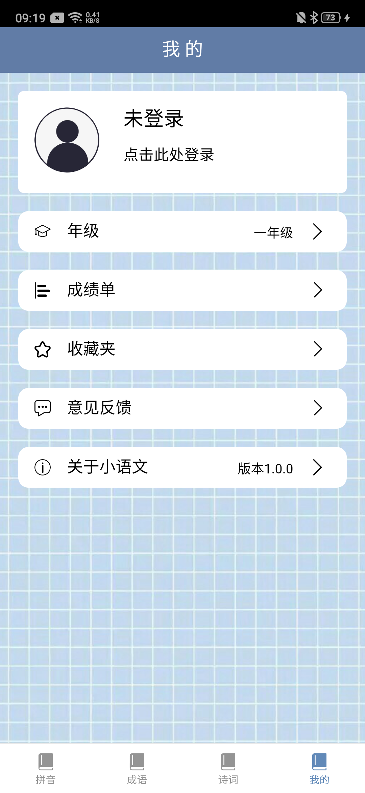

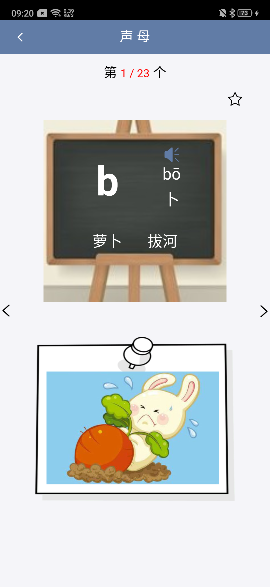

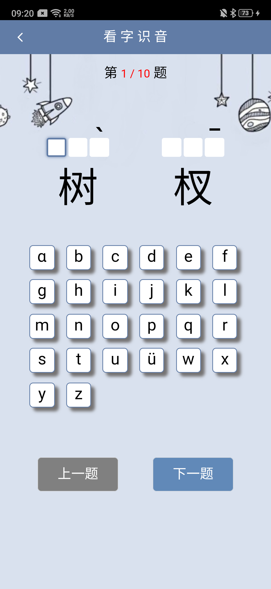

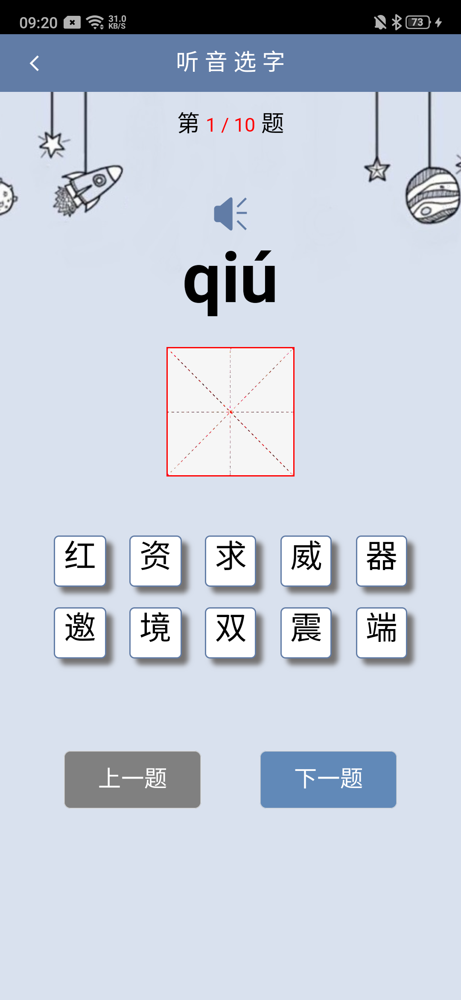

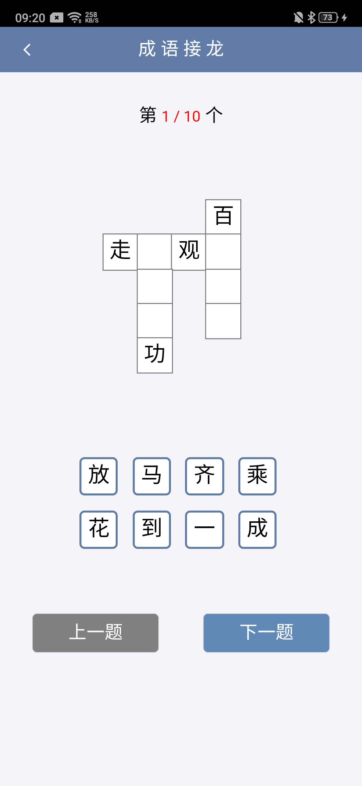

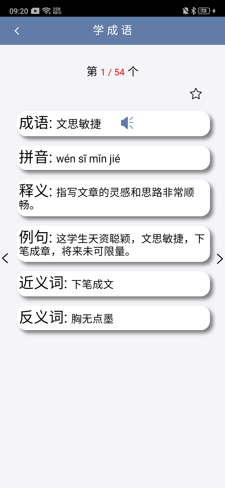

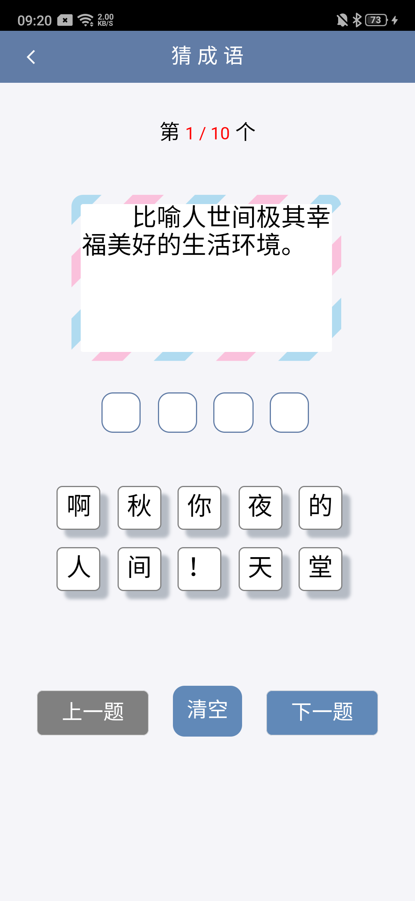

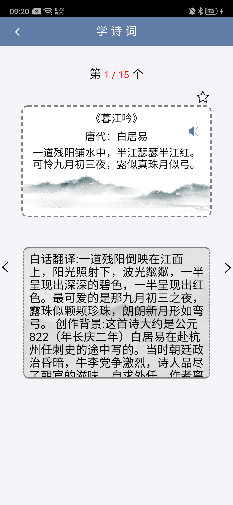

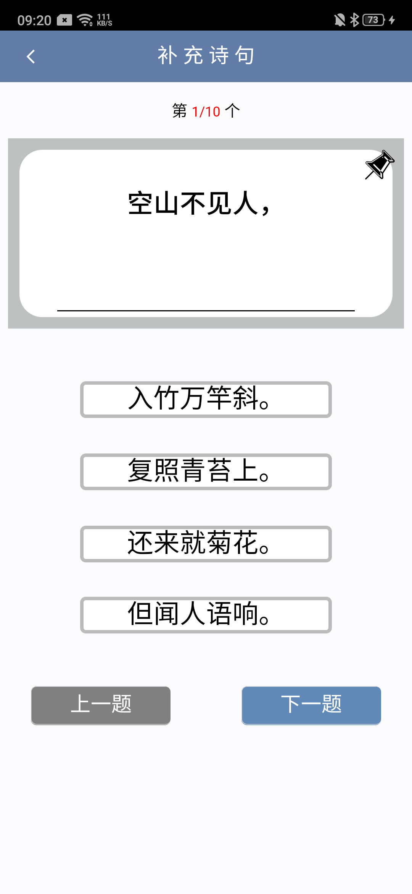

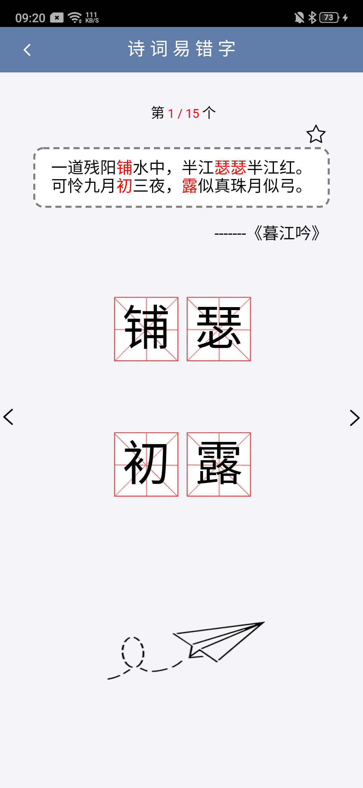

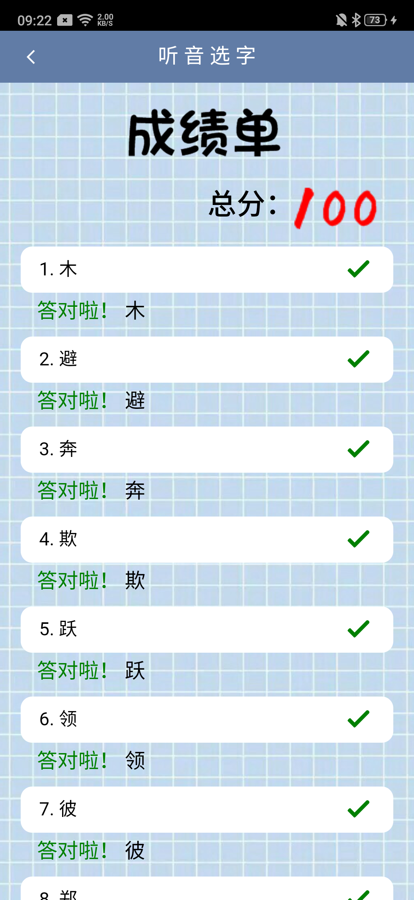

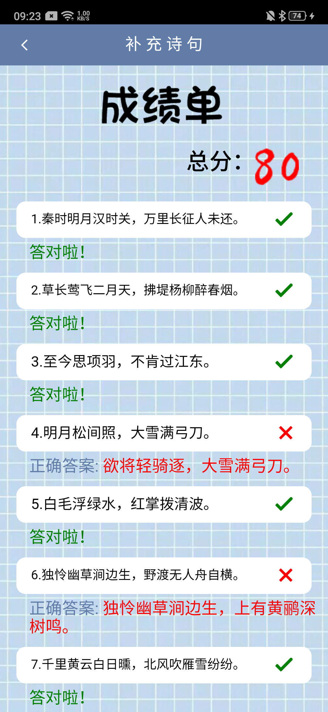

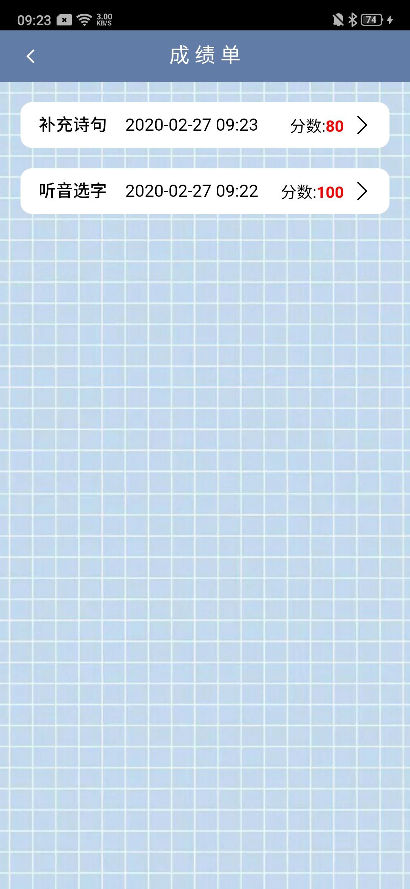

